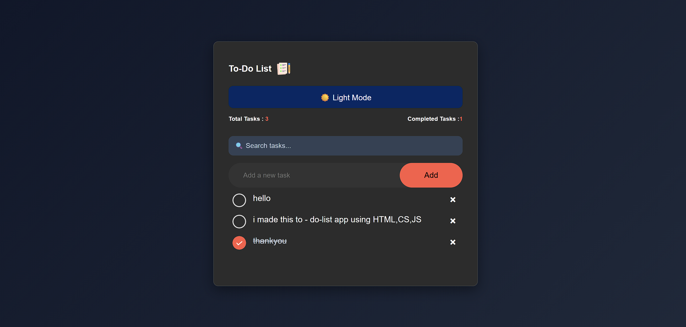

# Task Flow To-Do List — Productivity & Task Tracking App

A sleek, responsive, and distraction-free task management web application built with pure Vanilla JavaScript, semantic HTML5, and modern CSS3 featuring instant browser LocalStorage persistence, task completion state toggling, and dynamic DOM updates.

[](https://syedabsar99.github.io/todo-list-app/)
[](script.js)
[](style.css)
[](LICENSE)

---

## Preview



> **Live Demo:** [syedabsar99.github.io/todo-list-app](https://syedabsar99.github.io/todo-list-app/)

---

## Overview

Engineered by **Syed Noor Ul Absar**, this application delivers a focused, highly responsive task tracking experience. Built entirely without external frameworks or dependencies, it illustrates core DOM event delegation principles, input validation, and asynchronous persistence using browser Web Storage.

Tasks can be rapidly added via keyboard or mouse, marked as finished with strikethrough styling and custom checkmark states, or cleared permanently.

---

## Key Features

- **Instant Browser Persistence** — Employs `localStorage` to save task items and completion states continuously across browser reloads.
- **Event Delegation Architecture** — Utilizes centralized click event handling on list containers, ensuring efficient memory management and rapid DOM interaction.
- **Interactive Checkmark Toggling** — Click anywhere on a task item to toggle its completed state, accented with custom SVG/PNG checkmark visuals.
- **Keyboard-Friendly Workflow** — Add tasks instantly via the 'Enter' key or the dedicated submit button.
- **Input Validation & Anti-Empty Guard** — Rejects blank task submissions with visual alerts.
- **Mobile-Optimized Card Interface** — Clean responsive card that scales seamlessly on 320px–500px mobile screens without input squashing.

---

## Tech Stack

| Layer | Technologies | Details |
| :--- | :--- | :--- |
| **Structure** | Semantic HTML5 | Structured task lists (`<ul>`, `<li>`), accessible input fields |
| **Styling** | Modern CSS3 | Linear gradients, custom checkbox icons, responsive Flexbox, `@media` queries |
| **Logic** | Vanilla JavaScript (ES6+) | Event delegation (`e.target.tagName`), `localStorage` sync, DOM node manipulation |
| **Hosting** | GitHub Pages | Fast static CDN deployment |

---

## Project Structure

```text
todo-list-app/
├── images/            # Checkbox icons, delete buttons, and app graphics
├── index.html         # Application markup and task input container
├── LICENSE            # MIT open-source license
├── preview.png        # High-resolution application preview screenshot
├── README.md          # Comprehensive repository documentation
├── script.js          # Event delegation, task toggling, and storage sync
└── style.css          # Color scheme, list styling, and responsive queries
```

---

## Getting Started

No build configurations, node modules, or bundlers are required.

### 1. Clone the repository
```bash
git clone https://github.com/syedabsar99/todo-list-app.git
```

### 2. Open locally
Launch `index.html` in your browser:
```bash
cd todo-list-app
start index.html
```

Or run via any static web server:
```bash
npx serve .
# or
python -m http.server 8080
```

---

## Author & Contact

**Syed Noor Ul Absar**
- **Role**: Frontend Web Developer
- **Education**: Bachelor of Computer Applications (BCA), Chandigarh University (8.35 SGPA)
- **Portfolio**: [syedabsar99.github.io/portfolio](https://syedabsar99.github.io/portfolio/)
- **GitHub**: [@syedabsar99](https://github.com/syedabsar99)
- **LinkedIn**: [linkedin.com/in/syed-noor-ul-absar-7b6408365](https://www.linkedin.com/in/syed-noor-ul-absar-7b6408365/)
- **Email**: syedabsar99@gmail.com

---

## License

This project is licensed under the [MIT License](LICENSE) — feel free to use, modify, and distribute for educational or personal use.
